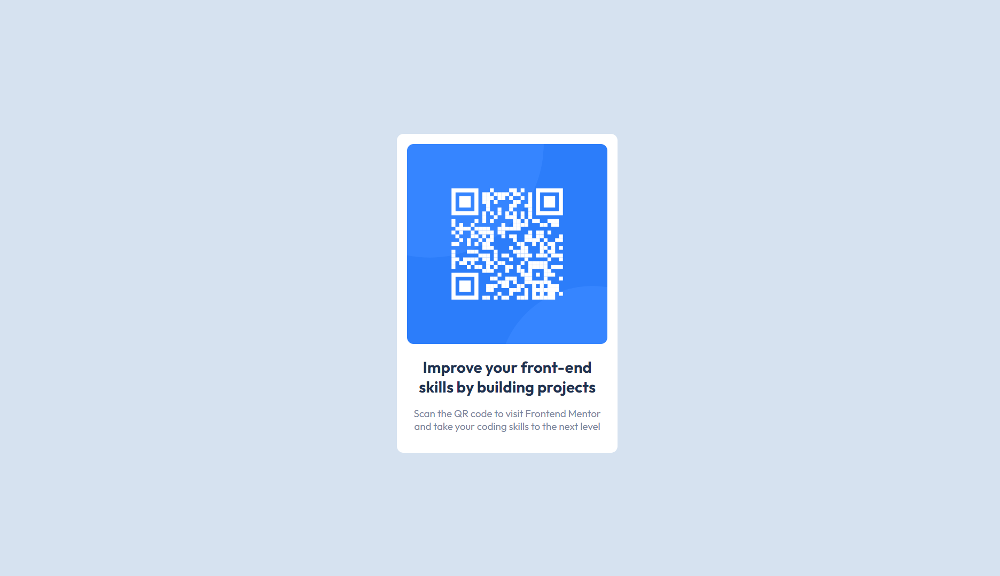

# Frontend Mentor - QR code component solution

This is a solution to the [QR code component challenge on Frontend Mentor](https://www.frontendmentor.io/challenges/qr-code-component-iux_sIO_H). Frontend Mentor challenges help you improve your coding skills by building realistic projects. 

## Table of contents

- [Overview](#overview)
  - [Screenshot](#screenshot)
  - [Links](#links)
- [Built with](#built-with)
- [Author](#author)

## Overview

This is the 'tutorial' challenge when you start using Frontend Mentor. It is meant to guide you through the basics of downloading the guidelines of a project and uploading your solution.

### Screenshot

### Links

- Solution URL: [QR Component]([https://hoyosdev.github.io/qrcomponent/])

### Built with

- HTML
- CSS
- Mobile-first workflow

## Author

- Frontend Mentor - [@hoyosdev](https://www.frontendmentor.io/profile/yourusername)

